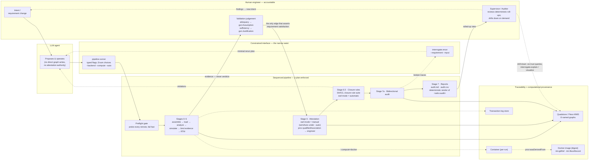
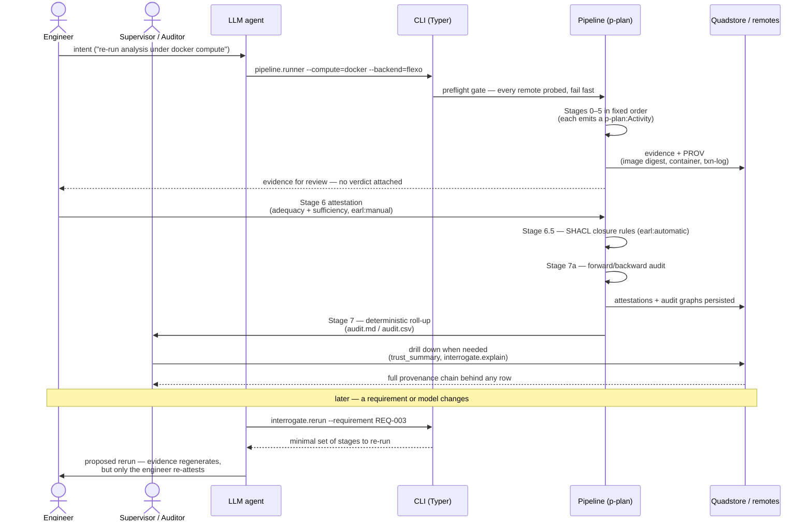

# The AI-Aided Engineering Loop

An LLM agent accelerates the engineering work in this demo, but it cannot be
accountable for any of it. The demo does not constrain the agent with policy
text; it constrains it by **interface**. Everything the agent can do passes
through a narrow waist of typed CLI surfaces; everything the pipeline produces
is checked by SHACL closure rules; every stage emits a `p-plan:Activity` so the
construction process is itself queryable; and the only edge in the whole graph
that asserts requirement satisfaction is human attestation. Evidence — however
it was computed, and however reproducibly — only ever *supports* that
judgement.

The term discipline of the repo applies to the loop itself: **verification**
is automated and fully specified (SHACL conformance, digest matching,
behavior-oracle metric-vs-criterion comparison) and is therefore safe to
delegate to machines and to re-run; **validation** is human judgement (model
adequacy, evidence sufficiency) and is therefore reserved for the accountable
engineer, recorded with `earl:mode = earl:manual` and a
`prov:qualifiedAssociation` naming who judged. The agent sits on the
verification side of that line and never crosses it. Above the attesting
engineer, supervisor and auditor roles review the same record through
deterministically compiled roll-ups, drilling down to detail when needed.

**Architecture vs. demo instantiation.** This document describes the
architecture; the repo demonstrates its feasibility by instantiation, and the
two differ in one deliberate place. So the loop can run end-to-end without an
operator present, `pipeline.runner --auto` substitutes a scripted stand-in for
the engineer's role, and the record marks that substitution honestly:
auto-attestations carry `earl:mode = earl:semiAuto`, never `earl:manual`, so
no quad ever claims a human judgement that did not happen. That the
substitution is visible *in the record itself* is the constraint structure
working as designed; a production deployment gates or disables the flag and
reserves Stage 6 for the accountable engineer.

## Standing constraint structure

Solid edges are the forward flow of one run; dotted edges are feedback and
provenance references. Four properties of the topology do the governing:

- **The narrow waist.** The agent reaches the pipeline only through Typer
  CLIs whose flags are typed and whose choices are `Enum`-validated. There is
  no API for "write a triple into the attestations graph" — the only producer
  of attestations is Stage 6, and Stage 6's input is the engineer (or, in the
  demo instantiation, the `--auto` stand-in, whose attestations are
  distinguishable in the graph by `earl:mode = earl:semiAuto`).
- **Evidence flows to the human, verdicts flow from the human.** Stages 0–5
  hash and bind artifacts but attach no judgement. The engineer's validation
  judgement (adequacy as `gsn:Assumption`, sufficiency as
  `gsn:Justification`) is the sole bridge from evidence to requirement
  satisfaction.
- **Verification closes the loop, it doesn't settle it.** SHACL violations
  and audit gaps route back to the agent as work — via `interrogate.rerun`,
  which translates a verification report into the minimal set of stages to
  re-run. Re-running regenerates evidence; it never regenerates attestation.
- **Oversight scales because the roll-up is deterministic.** Stage 7 reports
  (`output/audit.md`, `audit.csv`) are pure renders of the `<adcs:audit>`
  graph — same graph, same report — so they sit on the verification side of
  the line. Supervisors and auditors review at roll-up altitude by default
  and, when something warrants it, drill into the same named graphs that back
  the engineer's attestation (the six trust queries, `interrogate.explain` /
  `visualize`); there is no separately curated view to drift from the record.
  Their review redirects work — it does not attest; aggregated sign-off gates
  are future work (multi-attestation aggregation policy).

## One trip around the loop

## Constraint inventory

| Constraint | Mechanism | Where |
|---|---|---|
| Agent acts only through typed surfaces | Typer CLIs, Enum-validated choices | [`pipeline/runner.py`](pipeline/runner.py), [`interrogate/rerun.py`](interrogate/rerun.py) |
| Activity sequencing | p-plan steps + the runner's ordered stage calls; every stage emits a `p-plan:Activity` | [`pipeline/plan.ttl`](pipeline/plan.ttl), [`pipeline/runner.py`](pipeline/runner.py) |
| No silent degrade | Preflight gate probes all configured remotes before Stage 0 | [`pipeline/runner.py`](pipeline/runner.py) |
| Structural invariants | 18 SHACL closure-rule shapes (Stage 6.5) | [`ontology/rtm_shapes.ttl`](ontology/rtm_shapes.ttl), [`traceability/verification.py`](traceability/verification.py) |
| Human accountability for validation | Attestation carries `prov:qualifiedAssociation` to the engineer; `earl:mode` records how the judgement was made (`earl:manual`; `earl:semiAuto` for the demo's `--auto` stand-in); only `rtm:attests` links to requirement satisfaction | [`traceability/attestation.py`](traceability/attestation.py) |
| Reproducible verification | `rtm:ClosureRuleAssertion`, `rtm:DigestMatchAssertion`, `rtm:BehaviorOracleAssertion` — all `earl:automatic`, over content-addressed inputs | [`traceability/oracle_assertion.py`](traceability/oracle_assertion.py), [`interrogate/reproduce.py`](interrogate/reproduce.py) |
| Computational provenance | image / container / host PROV chain + transaction-log records | [`compute/`](compute/), [ARCHITECTURE.md](ARCHITECTURE.md) |
| Scalable oversight | Stage 7 reports are deterministic renders of the audit graph; six trust queries + `interrogate.explain` / `visualize` give drill-down to the same quads | [`pipeline/runner.py`](pipeline/runner.py), [`traceability/audit.py`](traceability/audit.py), [`traceability/queries.py`](traceability/queries.py), [`interrogate/explain.py`](interrogate/explain.py) |
| Loop closure | `interrogate.rerun` translates verification reports into minimal stage re-runs | [`interrogate/rerun.py`](interrogate/rerun.py) |

The result: the agent can be arbitrarily capable inside the loop without
weakening the assurance argument, because capability and accountability are
separated by construction — the agent operates the verification machinery,
and the machinery is built so that validation can only come from a person.
